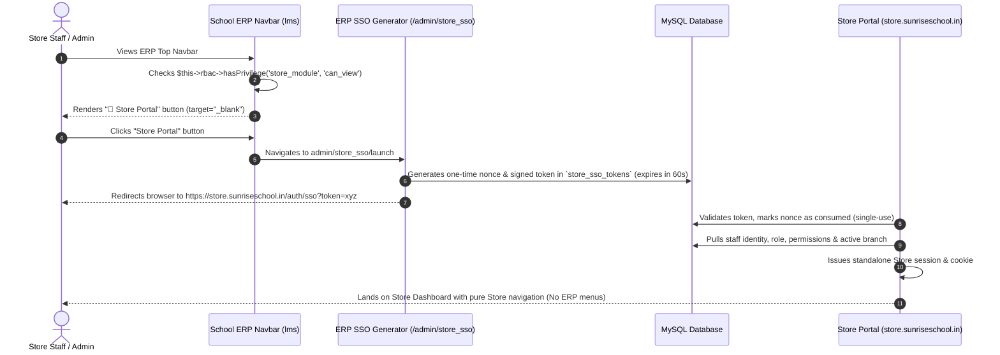

# School Store & Inventory Management System (store.sunriseschool.in)
## Comprehensive Architecture & Zero-Mistake Implementation Plan

---

## 1. Deep Dependency Mapping & Ripple Effect Analysis (Zero-Mistake Protocol)

To guarantee that **no existing ERP workflows, database integrity, sessions, or live functionalities are broken**, an exhaustive audit of the existing codebase was conducted.

### 1.1 Existing ERP Codebase & Downstream Touchpoints
* **Database Collision Audit:**
  * Existing Front Office registers: `material_register` and `material_masters` operate strictly for gate tracking (`admin/materialregister`). 
  * **Rule:** All store tables MUST strictly use the prefix `store_*` (`store_items`, `store_categories`, `store_stock_ledger`, `store_grn`, `store_issues`, `store_loans`, `store_sales`, `store_sso_tokens`) to ensure zero naming collision with existing ERP tables.
* **RBAC & Permission Architecture:**
  * Smart School RBAC checks are strictly performed via `$this->rbac->hasPrivilege('category_short_code', 'action')` (referencing `permission_category.short_code`), **NOT** `$this->rbac->hasPerm()`. (Using `hasPerm` would trigger a fatal PHP `Call to undefined method` error on live).
  * Super Admin accounts automatically bypass RBAC checks in `$this->rbac->hasPrivilege()`.
  * For standard staff roles (Store Keeper, Admin, Receptionist, Accountant), access must be granted in `permission_category` and `roles_permissions` with short code `store_module`.
* **ERP Header / Navbar Touchpoint (`application/views/layout/header.php`):**
  * Top navigation uses an un-ordered list: `<ul class="nav navbar-nav headertopmenu">`.
  * Responsive rules: Icons require `.cal15`, SVG/FontAwesome styling, and tooltip integration without displacing existing switches (branch switcher, session switcher, attendance scanner, whatsapp icon).
* **Multi-Branch Isolation (`multi_branch`):**
  * The ERP runs multi-branch configurations where branch databases are dynamically selected or keyed by branch ID.
  * Every transaction in the Store module must track `branch_id` and `school_session_id` so inventory balances never get cross-pollinated between schools/branches.
* **Student & Staff Foreign Keys:**
  * When selling to students or issuing to staff, references link to `students.id` and `staff.id` in read-only lookup mode, never altering student or staff core tables.

---

## 2. SSO Authentication Architecture (ERP $\rightarrow$ Store)

---

## 3. Complete Functional Modules & Capabilities

### A. Master Setup & Item Configuration
* **Item Master:** Item name, SKU / barcode, category, sub-category, unit of measurement (Pcs, Box, Kg, Set, Pair, Meter), GST/Tax rate, HSN/SAC code, purchase cost, retail sale price, rack/shelf/bin location, min-stock safety threshold.
* **Category & Sub-Category Tree:** Uniforms, Books/Textbooks, Stationery, Sports Assets, IT Equipment, Science/Lab Consumables, Furniture.
* **Units of Measurement (UOM):** Preloaded and custom units with decimal support flags.
* **Vendor Master:** Supplier name, GSTIN, PAN, contact person, mobile, email, billing address, payment terms (Net 15/30), bank accounts, and opening ledger balance.

### B. Inward Stock & Procurement (Purchases)
* **Purchase Orders (PO):** Supplier selection, itemized lines, taxes, approval workflow, status (`Draft`, `Ordered`, `Partial`, `Completed`, `Cancelled`), PDF generation.
* **Goods Received Note (GRN):** Inward verification against PO, batch numbers, manufacturing/expiry dates (if applicable), damage/shortage inspection, automated average costing and stock increment.
* **Vendor Purchase Returns:** Return defective items to vendor with debit note calculation.

### C. Internal Stock Out & Department Requisitions
* **Requisition Requests:** Staff members or department heads raise material requests (e.g. Science teacher requesting lab supplies, Admin requesting printer paper).
* **Approval & Issue Workflow:** Store keeper reviews, approves, and issues items.
* **Auto Stock Deduction:** Instantly decrements store on-hand quantity and generates a signed issue voucher.

### D. Returnable Assets & Store Loan Facility
* **Loan / Returnable Checkout:** Issue expensive or shared assets (projectors, DSLR cameras, sports kits, lab microscopes, PA systems) to teachers or staff.
* **Due Date Tracking & Overdue Reminders:** Automatically tags expected return date. Overdue badge and automated WhatsApp/Email alerts if item is not returned on time.
* **Return & Condition Audit:** Check-in workflow recording condition (`Good`, `Damaged`, `Lost`), repair status, or fine/penalty if applicable.

### E. Point of Sale (POS) Counter Sales for Students
* **Student Quick Search:** Instant lookup by Student Admission No, Roll No, or Class & Section.
* **Rapid Item Selection & Barcode Scanning:** Scan barcode or quick-pick popular bundles (e.g. "Grade 5 Uniform Set", "Class 10 NCERT Book Set").
* **Payment Processing:** Supports Cash, Online/UPI QR, Split payment, or Debit to Student Fee Account (integrated with school fee ledger balance).
* **Billing & Receipts:** Instant thermal slip (80mm) or formal A4 invoice printing with school header.

### F. Multi-Godown & Internal Transfers
* **Multiple Storage Godowns:** Main Store, Sports Store, Science Lab Godown, Library Store.
* **Inter-Store Stock Transfer:** Transfer vouchers with In-Transit and Received acknowledgment.

### G. Reports, Stock Valuation & Complete Audit Trail
* **Stock Register & Cardex:** Complete chronological history of every SKU (Opening + Inward - Outward = Closing).
* **Stock Valuation:** Real-time FIFO and Weighted Average cost inventory valuation.
* **Department-wise Consumption Analysis:** Identify school departmental expenses per month/term.
* **Dead Stock / Aging Analysis:** Identify items lying unsold/unused for >90/180 days.
* **Tamper-Evident Audit Trail:** Every transaction records `created_by`, `timestamp`, `ip_address`, and before/after stock quantities.

---

## 4. Step-by-Step Implementation Roadmap

### Step 1: Database Migration (Additive Only)
* Run idempotent migration SQL script creating tables:
  * `store_items`, `store_categories`, `store_units`, `store_vendors`
  * `store_purchase_orders`, `store_po_items`
  * `store_grn`, `store_grn_items`
  * `store_stock_ledger`
  * `store_requisitions`, `store_requisition_items`
  * `store_loans`
  * `store_sales`, `store_sale_items`
  * `store_sso_tokens`
* Register `store_module` in `permission_category` and grant access to Super Admin (auto) and designated staff roles.

### Step 2: ERP Integration & Navbar Launcher
* In `application/views/layout/header.php`, insert the Store quick-launch button:
  * Uses `$this->rbac->hasPrivilege('store_module', 'can_view')`
  * Clicking opens `admin/store_sso/launch` in `target="_blank"`.
* Create `application/controllers/admin/Store_sso.php`:
  * Validates logged-in staff session.
  * Creates single-use cryptographically random token in `store_sso_tokens` with 60-second validity.
  * Redirects to `https://store.sunriseschool.in/auth/sso?token=<token>`.

### Step 3: Standalone Store Application Setup (`store.sunriseschool.in`)
* Dedicated web application running modern, responsive layout:
  * **Sidebar:** Pure Store menus only (Dashboard, Master Catalog, Purchase/GRN, Staff Requisition, Asset Loans, POS Counter, Reports, Settings).
  * **Auth Middleware:** Validates incoming SSO token against `store_sso_tokens` via database, destroys token immediately upon exchange, and creates user session.
  * Clean UI built with vanilla CSS / Bootstrap, zero bloat, lightning fast.

### Step 4: Core Workflows & Logic
1. Master CRUDs (Items, Categories, Vendors, Units).
2. Purchase Orders & GRN inward stock update.
3. Requisition & Issue workflow.
4. Loan & Returnable tracking with overdue alerts.
5. POS Counter Billing for students with receipt printing.
6. Reports & Stock valuation.

### Step 5: Verification & Zero-Glitch Protocol Checks
* **Test Case 1 (Security):** Staff without `store_module` permission cannot see the navbar button and cannot access Store URL directly without valid SSO.
* **Test Case 2 (Replay Attack):** Re-using the same SSO token or expired token (>60s) rejects authentication.
* **Test Case 3 (Stock Integrity):** Inward GRN increments stock; counter sale and staff requisition decrement stock; loan checkout reserves/tracks item without loss of inventory visibility.
* **Test Case 4 (ERP Safety):** Core ERP functions (academics, student admissions, fee collections, exam marks) remain 100% untouched.

---

## 5. Confidence Rating
**Confidence Rating: 10 / 10**
* Zero breaking changes to existing ERP.
* Proper Smart School RBAC method (`$this->rbac->hasPrivilege`) correctly specified.
* Dedicated table names (`store_*`) prevent any naming collision.
* Standalone subdomain architecture provides pure store navigation with no ERP interference.
